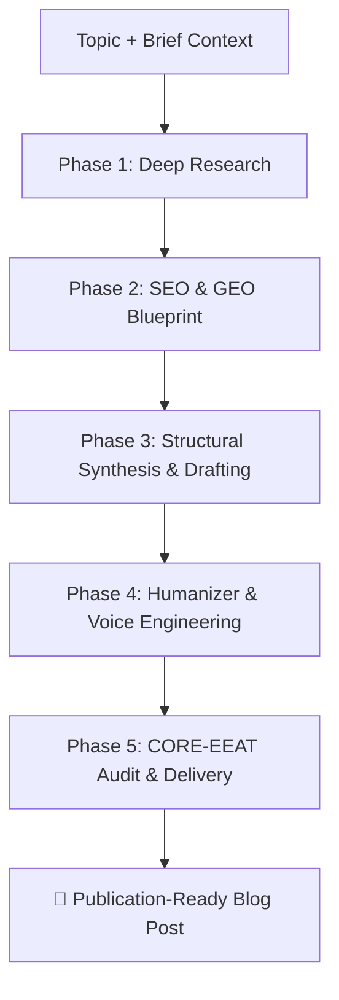

# ✍️ Topic-to-Blog: Autonomous High-Authority Blog Generation Skill

[](#)
[](#)
[](#)
[](#)

An enterprise-grade agentic skill that transforms any topic and brief context into a comprehensive, deeply researched, SEO/GEO-optimized, and humanized blog post.

---

## 🌟 Overview

Writing modern long-form content requires more than basic LLM text generation. Top-performing articles must satisfy **Traditional Search Engines (Google SEO)**, **Generative AI Citation Engines (Perplexity, ChatGPT Search, Gemini AI Overviews)**, and **Discerning Human Readers**.

`topic-to-blog` orchestrates an autonomous 5-phase production pipeline backed by specialized modular sub-skills to produce publication-ready content with real data, custom visual diagrams, structured comparison matrices, and authentic human cadence.

---

## 🚀 The 5-Phase Production Pipeline



### 1. 🔍 Deep Research (`references/deep-research/`)
- **Landscape Mapping & Dimension Drilldowns**: Explores 3–5 key architectural and thematic dimensions.
- **4 Core Information Types**: Systematically gathers:
  - **Facts & Data**: Concrete statistics, benchmark metrics with units (%, ms, $, GB), sample sizes, and dates.
  - **Examples & Case Studies**: Real-world production implementations and war stories.
  - **Expert Debates**: Consensus views and contrarian technical trade-offs.
  - **Future Trajectories**: 12-to-36-month horizon projections.
- **Synthesis Quality Gate**: Zero drafting on assumptions or single search queries.

### 2. 🎯 SEO & Generative Engine Optimization (`references/seo-geo/`)
- **Search Intent & Keyword Mapping**: Targets high-intent queries with 3–5 conversational long-tail variants.
- **GEO Direct Answer Engine**: Crafts high-density direct answers (<150 words) right below the title/intro to maximize citations by AI answer engines.
- **Archetype Template Selection**: Automatically selects from 4 tailored templates in `references/blog-archetypes.md`:
  - *Archetype 1*: Deep-Dive Technical / Conceptual Guide
  - *Archetype 2*: Opinionated Thought Leadership & Strategic Essay
  - *Archetype 3*: Comparative Breakdown & Benchmark Matrix
  - *Archetype 4*: Case Study & Practical How-To Walkthrough
- **CORE-EEAT Compliance**: Follows the 8 core quality dimensions (Clarity, Organization, Referenceability, Exclusivity, Experience, Expertise, Authority, Trust).

### 3. 🛠️ Deep Drafting & Structural Synthesis
- **No Generic Openings**: Bans throat-clearing intros (*"In today's fast-paced digital world..."*) in favor of immediate hooks and problems.
- **Visual Architecture**: Generates custom **Mermaid diagrams** (flowcharts, sequence diagrams, architecture maps).
- **Structured Tables & Code**: Embeds side-by-side comparison matrices and runnable code snippets with language syntax highlighting.

### 4. 🧠 Humanizer Engine (`references/humanizer/`)
- **24 AI Slop Anti-Patterns Eradicated**: Purges significance inflation (*"stands as a testament"*), trailing `-ing` clauses, banned vocabulary (*delve*, *utilize*, *transformative*, *plethora*, *beacon*, *tapestry*), and weasel attributions.
- **Voice, Rhythm & Nuance**: Mixes short punchy sentences with rhythmic analytical prose, grounded opinions on trade-offs, and natural first/second-person perspectives.

### 5. ✅ CORE-EEAT Audit & Multi-Format Delivery
- **Pre-Publish Quality Check**: Rigorous verification against `references/quality-checklist.md`.
- **Deliverables**: Markdown with full YAML frontmatter, with optional exports to DOCX, PDF, interactive HTML web artifacts, and custom visual hero images.

---

## 📂 Repository Structure

```
topic-to-blog/
├── SKILL.md                          # Master Orchestrator Skill
├── README.md                         # Project Documentation
└── references/
    ├── blog-archetypes.md            # Structural templates (Guides, Essays, Comparisons, Case Studies)
    ├── quality-checklist.md          # Pre-publish CORE-EEAT verification checklist
    ├── deep-research/
    │   └── SKILL.md                  # Systematic 4-phase research methodology
    ├── seo-geo/
    │   ├── SKILL.md                  # Keyword intent, GEO direct answers, & heading architecture
    │   └── references/
    │       ├── core-eeat.md          # 80-item CORE-EEAT benchmark details
    │       └── geo-optimization.md   # Generative Engine Optimization strategies
    └── humanizer/
        ├── SKILL.md                  # Human voice engineering & cadence tuning
        └── references/
            └── slop-patterns.md      # Full catalog of 24 AI-slop anti-patterns & fixes
```

---

## 💡 When to Trigger This Skill

Trigger this skill whenever you need to:
- Write an in-depth blog post or publication-grade technical article from a topic and brief notes.
- Turn an engineering concept, architectural debate, or product feature into thought leadership.
- Optimize content for both top Google SERP ranking and AI citation in Perplexity, Claude, ChatGPT, and Google Gemini AI Overviews.

### Example Prompts
- *"Write a comprehensive blog post on MCP (Model Context Protocol) and its impact on multi-agent architectures."*
- *"Draft a deep-dive technical guide comparing SQLite vector extensions vs dedicated vector databases with benchmarks."*
- *"Create an opinionated thought leadership essay on why developer experience is the biggest bottleneck in AI agent adoption."*

---

## 📋 Quality Guarantee

Every blog post generated with this skill meets the following baseline:
- [x] High-density direct answer block within the first 150 words for AI citations
- [x] At least 3–5 quantitative metrics with concrete units
- [x] Zero AI slop vocabulary and structural inflation
- [x] Custom visual Mermaid diagram or benchmark comparison matrix
- [x] Strict heading hierarchy with question-phrased FAQ subheadings
- [x] Complete YAML frontmatter ready for static site generators (Hugo, Astro, Next.js, Ghost)

---

## 📄 License

MIT © [Kushal Kambar](https://github.com/kushalkambar5)