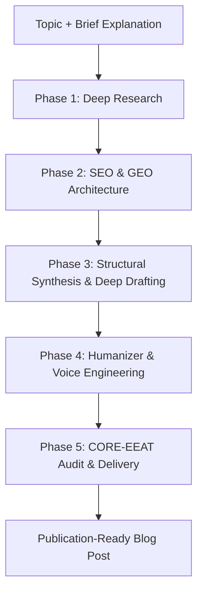

# Topic-to-Blog Master Skill

Transform any topic and brief explanation into a comprehensive, high-authority, publication-ready blog post. This skill executes an end-to-end 5-phase pipeline that synthesizes **deep multi-angle web research**, **SEO & Generative Engine Optimization (GEO)**, **visual architectural modeling**, and **voice humanization (zero AI slop)**.

---

## When to Trigger This Skill

Use this skill whenever:

- The user provides a **topic** and a **brief explanation/context** and wants a full blog post or article.
- The user says _"write a blog post on X"_, _"draft a comprehensive technical guide about X"_, _"create a thought leadership piece on X"_, or _"turn this concept into a publication-ready article"_.
- The user wants content optimized for both traditional search ranking (Google SEO) and AI answer engine citation (Perplexity, ChatGPT Search, Claude, Gemini AI Overviews).

---

## The 5-Phase Production Pipeline

---

### Phase 1: Deep Research (`deep-research`)

**Never draft on shallow knowledge or assumptions.** Before writing a single line of the blog post, execute systematic research across four distinct information types:

1. **Facts & Data**: Search for concrete statistics, benchmark numbers, dates, sample sizes, and empirical metrics with units (%, ms, $, GB).
2. **Examples & Case Studies**: Investigate real-world production implementations, company case studies, and practical war stories.
3. **Expert Opinions & Debates**: Capture authoritative perspectives, ecosystem consensus, and contrarian criticisms or trade-offs.
4. **Trends & Future Trajectories**: Identify 12-to-36-month horizon projections and emerging patterns.

> **Synthesis Check**: Confirm you have at least 3–5 specific data points, 2 concrete real-world examples, and a clear understanding of both benefits and friction points before moving to Phase 2.

---

### Phase 2: SEO & GEO Strategy & Blueprint (`seo-geo`)

Design the structural skeleton to maximize search ranking and Generative Engine Optimization (GEO):

1. **Target Keyword & Search Intent Mapping**:
   - **Primary Keyword**: Central high-intent search query.
   - **Secondary & Long-Tail Variants**: 3–5 conversational variants matching natural search behavior.
   - **Search Intent**: Explicitly align with informational, comparative, or tutorial intent.

2. **GEO-First Structural Architecture**:
   - **Title (H1)**: High-conviction, keyword-aligned, under 65 characters.
   - **Meta Description**: 140–160 character summary including primary keyword and clear value proposition.
   - **Direct Answer Block (<150 words)**: Place a high-density direct answer or core definition immediately below the title/intro. This enables AI engines (Perplexity, Google AI Overviews) to extract and cite your article directly.
   - **Heading Hierarchy**: Strict `# H1` → `## H2` → `### H3` sequence without skipping levels. Phase key H2s as natural questions for FAQ discovery.
   - **Structured Data Tables**: Plan at least 1 comparison matrix or specification table.

3. **Select Blog Archetype**:
   - Consult [references/blog-archetypes.md](references/blog-archetypes.md) to choose the best structural template:
     - _Archetype 1_: Deep-Dive Technical / Conceptual Guide
     - _Archetype 2_: Opinionated Thought Leadership & Strategic Essay
     - _Archetype 3_: Comparative Breakdown & Benchmark Matrix
     - _Archetype 4_: Case Study & Practical How-To Walkthrough

---

### Phase 3: Deep Drafting & Structural Synthesis (`doc-coauthoring` + visual assets)

Draft the complete, substantive article following high-density craftsmanship:

1. **The Hook (No Generic Openings)**:
   - Avoid generic throat-clearing (_"In today's fast-paced digital world..."_).
   - Open immediately with a real problem, surprising data point, or compelling practitioner observation.

2. **Section-by-Section Substantive Depth**:
   - Develop each H2 section with dedicated focus, actionable explanations, and technical precision.
   - Keep paragraphs between 2–5 sentences for optimal scannability and reading rhythm.
   - Use boldface selectively to emphasize key principles and takeaways.

3. **Visual Architecture Diagrams**:
   - Include custom **Mermaid diagrams** (flowcharts, sequence diagrams, state machines, or architecture maps) to make complex workflows immediately intuitive.

4. **Structured Comparison Tables & Code Blocks**:
   - Deliver clean Markdown tables for trade-offs, benchmarks, or feature comparisons.
   - Provide realistic, runnable code snippets with language syntax highlighting and explanatory comments.

---

### Phase 4: Humanizer Engine & Voice Engineering (`humanizer`)

Run the drafted text through the **Humanizer Engine** to eradicate machine-generated writing patterns and inject personality, soul, and cadence:

1. **Purge the 24 AI Slop Anti-Patterns**:
   - **Significance Inflation**: Delete `"stands as a testament"`, `"marks a pivotal moment"`, `"underscores the importance"`. State facts simply.
   - **Shallow Trailing `-ing` Clauses**: Eliminate lazy participial endings (`, showcasing...`, `, highlighting...`).
   - **Banned AI Vocabulary**: Replace `delve`, `utilize`, `transformative`, `plethora`, `beacon`, `tapestry`, `groundbreaking` with simple, natural English.
   - **Weasel Attributions**: Replace `"industry experts say"` with specific named citations or benchmark sources.
   - **Negative Parallelisms**: Cut clichéd `"not just about X, but Y"` constructions.

2. **Inject Authentic Voice, Rhythm & Nuance**:
   - **Sentence Cadence**: Mix short, punchy statements with longer, rhythmic explanatory sentences.
   - **Grounded Opinions**: Take a clear stance on technical trade-offs. Don't be timidly neutral—explain where tools fail and why certain architectures are overkill.
   - **Conversational Momentum**: Use first-person ("we observed", "in our experience") and second-person ("when you configure...") perspectives naturally.

---

### Phase 5: CORE-EEAT Quality Gate & Multi-Format Delivery

Audit the completed article against the [references/quality-checklist.md](references/quality-checklist.md):

1. **Quality Self-Audit**:
   - [ ] Direct answer block present in first 150 words.
   - [ ] Minimum 3–5 specific quantitative metrics with units.
   - [ ] Clear heading hierarchy with question-phrased FAQ subheadings.
   - [ ] 100% free of AI slop vocabulary and structural inflation.
   - [ ] Visual Mermaid diagram or structured comparison table included.

2. **Deliverable Presentation**:
   - Present the finalized article in clean, beautifully formatted Markdown with complete YAML frontmatter (title, slug, date, author, tags, meta description).
   - If the user desires additional formats, leverage workspace tools to export as:
     - **DOCX / PDF**: Using `docx` or `pdf` skills for offline publication.
     - **Interactive Web / HTML Article**: Using `theme-factory` or `web-artifacts-builder`.
     - **Custom Visuals / Hero Images**: Using `generate_image` or `canvas-design`.

---

## Reference Guides

- **Archetype Blueprints**: [references/blog-archetypes.md](references/blog-archetypes.md)
- **Pre-Publish Quality Checklist**: [references/quality-checklist.md](references/quality-checklist.md)
- **Deep Research Methodology**: [references/deep-research/SKILL.md](references/deep-research/SKILL.md)
- **SEO/GEO & CORE-EEAT 80-Item Benchmark**: [references/seo-geo/SKILL.md](references/seo-geo/SKILL.md)
- **Humanizer & AI-Slop Anti-Patterns**: [references/humanizer/SKILL.md](references/humanizer/SKILL.md)
