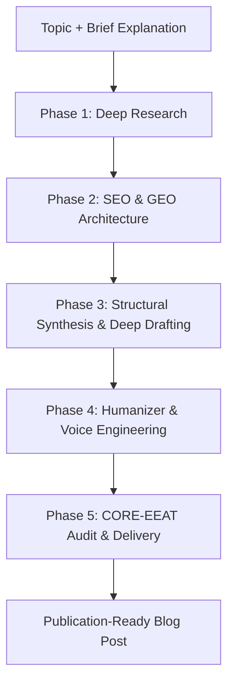

# Topic-to-Blog Master Skill

Transform any topic and brief explanation into a comprehensive, high-authority, publication-ready blog post. This skill executes an end-to-end 5-phase pipeline that synthesizes **deep multi-angle web research**, **SEO & Generative Engine Optimization (GEO)**, **visual architectural modeling**, and **voice humanization (zero AI slop)**.

---

## When to Trigger This Skill

Use this skill whenever:

- The user provides a **topic** and a **brief explanation/context** and wants a full blog post or article.
- The user says _"write a blog post on X"_, _"draft a comprehensive technical guide about X"_, _"create a thought leadership piece on X"_, or _"turn this concept into a publication-ready article"_.
- The user wants content optimized for both traditional search ranking (Google SEO) and AI answer engine citation (Perplexity, ChatGPT Search, Claude, Gemini AI Overviews).

---

## The 5-Phase Production Pipeline

---

### Phase 1: Deep Research (`deep-research`)

**Never draft on shallow knowledge or assumptions.** Before writing a single line of the blog post, consult and execute the full research methodology in **[references/deep-research/SKILL.md](references/deep-research/SKILL.md)**.

- **Explore & Drill Down**: Conduct broad exploration (landscape mapping) and targeted dimension drilldowns.
- **Cover the 4 Information Types**: Gather concrete facts & data (metrics, benchmarks), real-world examples & case studies, expert opinions & debates, and future trends/projections.
- **Pass the Synthesis Quality Gate**: Ensure you have verified metrics, primary sources, balanced viewpoints, and zero knowledge gaps before moving to Phase 2.

---

### Phase 2: SEO & GEO Strategy & Blueprint (`seo-geo`)

Design the structural skeleton to maximize search ranking and Generative Engine Optimization (GEO) by consulting **[references/seo-geo/SKILL.md](references/seo-geo/SKILL.md)** and selecting a template from **[references/blog-archetypes.md](references/blog-archetypes.md)**.

- **Query Intent & Keywords**: Map primary search intent, target keyword, and 3–5 long-tail/conversational queries.
- **GEO-First Architecture**: Blueprint the title (H1 <65 chars), meta description (140–160 chars), direct answer block (<150 words for AI citations), strict heading hierarchy (`# H1` → `## H2` → `### H3`), and data tables.
- **Archetype Template Selection**: Choose from [references/blog-archetypes.md](references/blog-archetypes.md) (_Deep-Dive Guide_, _Thought Leadership Essay_, _Comparative Matrix_, or _Case Study Walkthrough_).
- **CORE-EEAT Alignment**: Structure the post to satisfy the 8 core quality dimensions (Clarity, Organization, Referenceability, Exclusivity, Experience, Expertise, Authority, Trust).

---

### Phase 3: Deep Drafting & Structural Synthesis (`doc-coauthoring` + visual assets)

Draft the complete, substantive article following high-density craftsmanship:

1. **The Hook (No Generic Openings)**:
   - Avoid generic throat-clearing (_"In today's fast-paced digital world..."_).
   - Open immediately with a real problem, surprising data point, or compelling practitioner observation.

2. **Section-by-Section Substantive Depth**:
   - Develop each H2 section with dedicated focus, actionable explanations, and technical precision.
   - Keep paragraphs between 2–5 sentences for optimal scannability and reading rhythm.
   - Use boldface selectively to emphasize key principles and takeaways.

3. **Visual Architecture Diagrams**:
   - Include custom **Mermaid diagrams** (flowcharts, sequence diagrams, state machines, or architecture maps) to make complex workflows immediately intuitive.

4. **Structured Comparison Tables & Code Blocks**:
   - Deliver clean Markdown tables for trade-offs, benchmarks, or feature comparisons.
   - Provide realistic, runnable code snippets with language syntax highlighting and explanatory comments.

---

### Phase 4: Humanizer Engine & Voice Engineering (`humanizer`)

Run the drafted text through the **Humanizer Engine** to eradicate machine-generated writing patterns and inject personality, soul, and cadence by consulting **[references/humanizer/SKILL.md](references/humanizer/SKILL.md)**.

- **Anti-Pattern Eradication**: Eliminate the 24 AI slop anti-patterns (significance inflation, trailing `-ing` clauses, banned AI vocabulary like `delve`/`utilize`/`transformative`, weasel attributions, and negative parallelisms). Refer to [references/humanizer/references/slop-patterns.md](references/humanizer/references/slop-patterns.md) for the full catalog.
- **Voice & Cadence Injection**: Vary sentence rhythm, take grounded engineering/business stances on trade-offs, and use natural first/second-person perspectives.

---

### Phase 5: CORE-EEAT Quality Gate & Multi-Format Delivery

Audit the completed article against the [references/quality-checklist.md](references/quality-checklist.md):

1. **Quality Self-Audit**:
   - [ ] Direct answer block present in first 150 words.
   - [ ] Minimum 3–5 specific quantitative metrics with units.
   - [ ] Clear heading hierarchy with question-phrased FAQ subheadings.
   - [ ] 100% free of AI slop vocabulary and structural inflation.
   - [ ] Visual Mermaid diagram or structured comparison table included.

2. **Deliverable Presentation**:
   - Present the finalized article in clean, beautifully formatted Markdown with complete YAML frontmatter (title, slug, date, author, tags, meta description).
   - If the user desires additional formats, leverage workspace tools to export as:
     - **DOCX / PDF**: Using `docx` or `pdf` skills for offline publication.
     - **Interactive Web / HTML Article**: Using `theme-factory` or `web-artifacts-builder`.
     - **Custom Visuals / Hero Images**: Using `generate_image` or `canvas-design`.

---

## Reference Guides

- **Deep Research Methodology**: [references/deep-research/SKILL.md](references/deep-research/SKILL.md)
- **SEO/GEO & CORE-EEAT Guide**: [references/seo-geo/SKILL.md](references/seo-geo/SKILL.md)
- **Archetype Blueprints**: [references/blog-archetypes.md](references/blog-archetypes.md)
- **Humanizer & AI-Slop Anti-Patterns**: [references/humanizer/SKILL.md](references/humanizer/SKILL.md)
- **Pre-Publish Quality Checklist**: [references/quality-checklist.md](references/quality-checklist.md)
